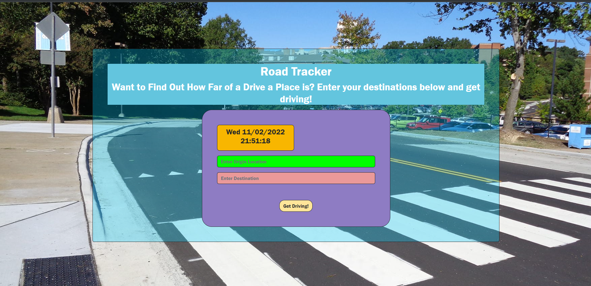
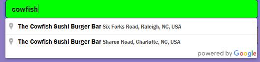
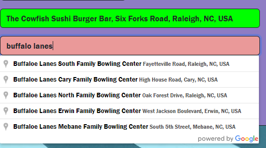
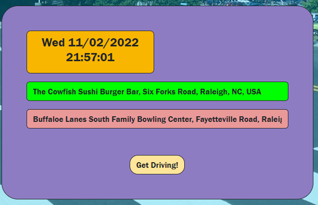
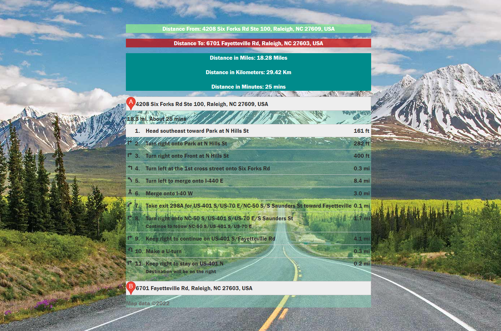

<h1>Drive Destination App</h1>
<h2>Group members: Josh Toback, Kelly Williams, Alex Doyle, Hunter White<h2>

#

# About Our Site
## Before people could type and tap their way to their destination, people often had to print out their directions on their old computers and read them as they traveled. This site acts in the same way, but allows people to combine old metholodgies and new technologies to see (in the US) where they can go, how long it takes to get there, and how far it is to travel (by car)! 

## This app is designed for users in the go; people who are curious about travel time and distance in a hurry. Here's how it works!

#

<h2>Installation</h2>

## Check out our site [here](https://joshuatoback.github.io/Drive-Destination/)!

#

# Usage

## As soon as the page loads, you're greeted with the current time and date and an input screen that allows you to type up an origin address and a destination address. Or a departure/arrival address. Tomato, tomato you know? 

## Thanks to the Google Places API, you're able to search for your origin and destination locations! In this example, I searched up my favorite restaraunt and bowling alley!

##  

Fun Fact: if you know the area, ther's actually a bowling alley right near Cowfish, but I just wanted a random example that wouldn't list two stops!

## All that's left to do is hit the neat "Get Driving" button, and you'll get directions to where you're headed!

## 

## As soon as you hit that button, you're all set! All your information will be on display for you to print out or study for your next road trip! If you want to highlight a step, click on the one you want to take a closer look at! 

## 

# Future Implementations

## There's a few things we want to add to this site to make it more informative and exciting to use, and here's a few of our ideas!

## 1. Error Messages

## 2. Map Display

## 3. Weather and Current Time Display

## 4. International Travel

# Credits

<H2>APIS</h2>
<ul>
  <li>Google Directions API</li>
  <li>Distance Matrix API </li>
  <li>Maps JavaScript API </li>
  <li>Google Places API </li>
  </ul>

## MIT License

Copyright (c) [2022] 
